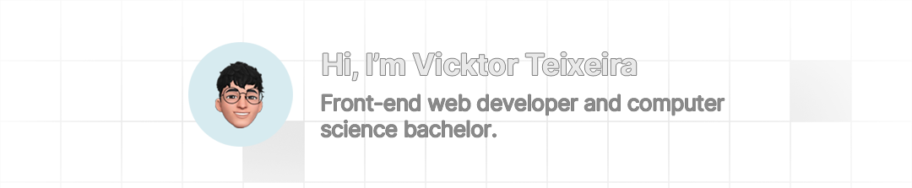

    
  ## About me
  I really enjoy programing and creating user interfaces as much as I like coffee ☕️ (that's what keeps me awake and alert lol). 
  I also like photography related stuff, that's what I like doing in my free time 📸. 
  I got a baby 🐈, his name's Freddy.  
  

  

  
  ## Technologies I use
  I have a strong foundation in various programming languages and technologies. My core proficiencies include:  
  
  
  
  
  
  
  
  
  
  
  

  
  ## Social and contact
  These are some of my social media and contacts: 

  
  
  

  

  

 

